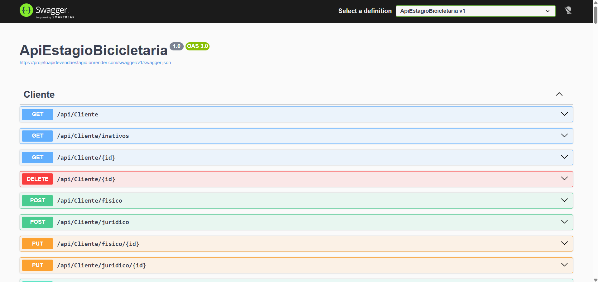
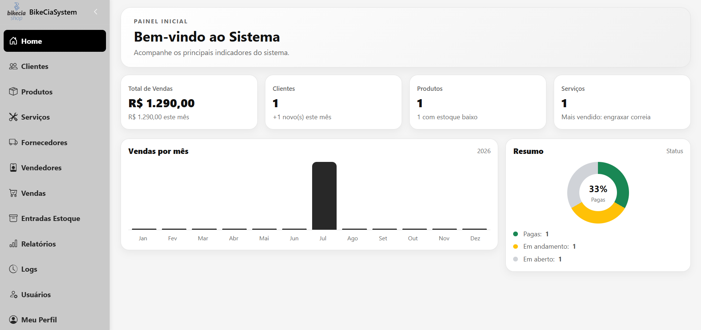
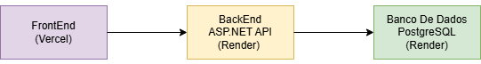
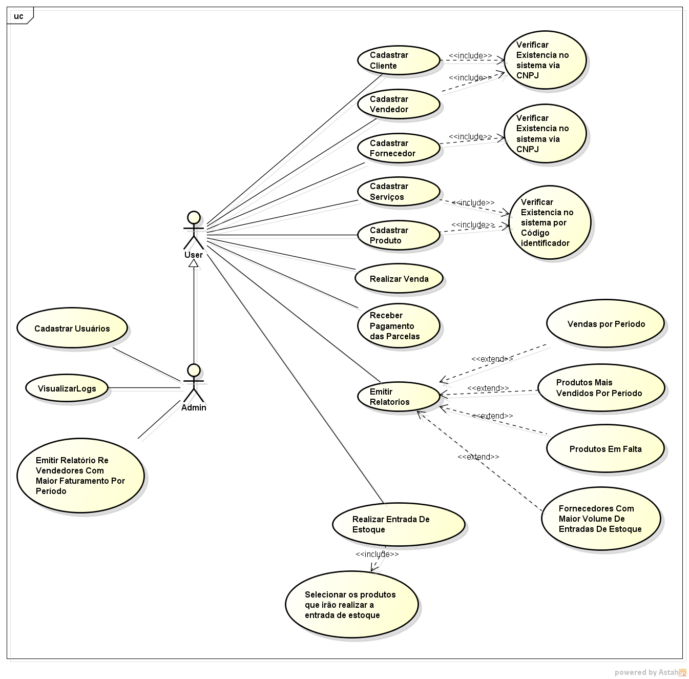
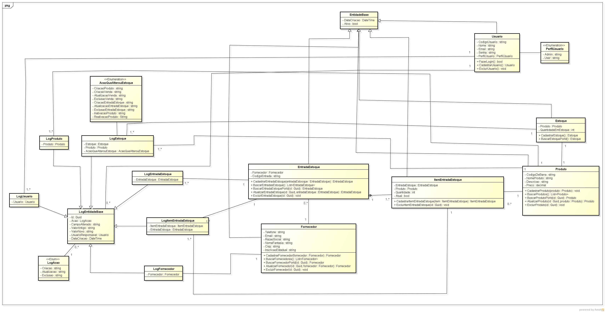
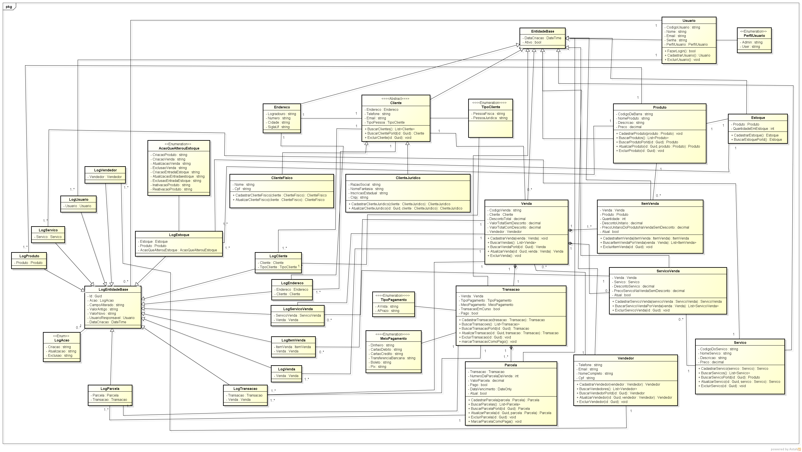
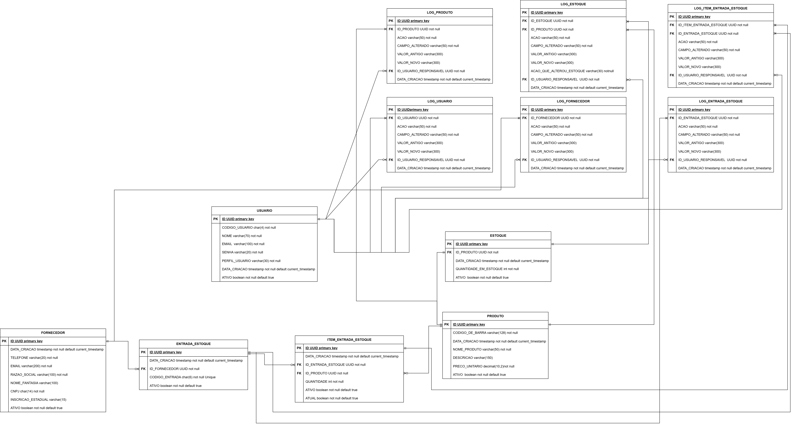
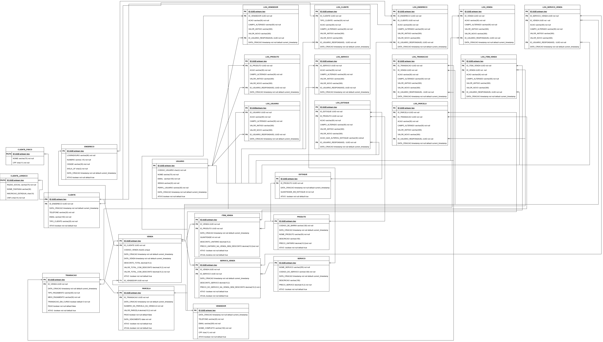

# BikeCiaSystem
 
O BikeCiaSystem é um sistema ERP desenvolvido para auxiliar bicicletarias no gerenciamento de vendas e controle de estoque.
 
Este projeto foi desenvolvido para a disciplina de Estágio Supervisionado do curso de Análise e Desenvolvimento de Sistemas da Faculdade UMFG.
 
Este repositório contém o backend (API) da aplicação, desenvolvido por mim utilizando C# e ASP.NET Core, responsável por garantir as regras de negócio, realizar a autenticação e autorização dos usuários, persistir os dados no PostgreSQL e disponibilizar os endpoints consumidos pelo frontend.

O frontend foi desenvolvido majoritariamente pelo meu parceiro, com meu auxílio, e está disponível em: https://github.com/Marcos-ZF/FrontProjetoFinal
 
## 📑 Sumário

- ☁️ [Demonstração](#️-demonstração)
- ✨ [Funcionalidades](#-funcionalidades)
- 🚀 [Tecnologias](#-tecnologias)
- 🏗️ [Arquitetura do Sistema](#️-arquitetura-do-sistema)
- 📐 [Diagramas do Sistema](#-diagramas-do-sistema)
- 🔧 [Como Executar o Projeto Localmente](#-como-executar-o-projeto-localmente)
- 🧪 [Testes](#-testes)
- 👨‍💻 [Desenvolvedor](#-desenvolvedor)
- 📄 [Licença](#-licença)


## ☁️ Demonstração  

### Backend e Swagger

O backend encontra-se publicado na plataforma Render e pode ser acessado em:

https://projetoapidevendaestagio.onrender.com/api

Os endpoints da API são documentados utilizando Swagger, que pode ser acessado em:

https://projetoapidevendaestagio.onrender.com/api/swagger




### Frontend

O frontend encontra-se publicado na Vercel e pode ser acessado em:

https://front-projeto-final-snowy.vercel.app/




### Usuário de demonstração

Para acessar o sistema utilize o usuário de demonstração:

- Email: demo@bikecia.com
- Senha: demo123

*Esse usuário possui a role de user e não é possível alterar nenhuma informação dele.


## ✨ Funcionalidades

### 🔐 Autenticação

- JWT
- Roles (Admin/User)
  
### 📋 Cadastros

- Clientes (físico ou jurídico)
- Produtos
- Serviços
- Vendedores
- Fornecedores
- Usuários (disponível somente para admins)
  
### 💰 Movimentações

- Venda
- Entrada de estoque
  
### 📊 Relatórios

- Produtos mais vendidos por período
- Produtos em falta
- Vendas por período
- Fornecedores com maior volume de entrada de estoque por período
- Vendedores com maior faturamento por período (disponível somente para admins)
  
### 📝 Auditoria

- Logs das operações (disponível somente para admins)
  
### 👤 Perfil do Usuário

- O usuário logado pode alterar suas informações, exceto a role.
  
## 🚀 Tecnologias

- C#
- ASP.NET Core
- Entity Framework
- PostgreSQL
- XUnit (Testes Unitários)
- BCrypt.Net
- QuestPDF
- Swagger
- Git
- Docker
- Postman


## 🏗️ Arquitetura do Sistema




## 📐 Diagramas do Sistema

### Diagrama de Casos de Uso




### Diagrama de Classes

#### Módulo de Entrada de Estoque



<hr>

#### Módulo de Venda




### Diagrama de Entidade Relacionamento

#### Módulo de Entrada de Estoque



<hr>

#### Módulo de Venda




## 🔧 Como Executar o Projeto Localmente

### Pré-requisitos

- .NET SDK 8.0
- PostgreSQL 13 ou superior
- Git


### 1. Clone o Repositório

Execute os comandos abaixo:

```bash
git clone https://github.com/MatheusHenriqueSouzaSantos/BikeCiaSystem

cd BikeCiaSystem
```

### 2. Configure o Banco de Dados PostgreSQL

- Crie um banco de dados no PostgreSQL chamado `projeto_estagio_bicicletaria`.
- Execute o script de criação das tabelas que está disponível na pasta `database` deste repositório.


### 3. Defina as Variáveis de Ambiente

Preencha as informações do banco de dados com seus dados e execute os comandos.

#### Windows (PowerShell)

```powershell
$env:ConnectionStrings__DefaultConnection="Host=localhost;Port=5432;Database=projeto_estagio_bicicletaria;Username=SEU_USERNAME_POSTGRES;Password=SEU_PASSWORD_POSTGRES;"
$env:Jwt__Key="H8rQ2mLp5ZwX7NcDv1FsKa9YtGu4BeJx0MiCn3RhPk6LsVq8AfTdWy5UzEnSb4Oo"
$env:User__CodigoUser="abcd"
$env:User__Email="admin2026@gmail.com"
$env:User__Nome="admin"
$env:User__Senha="admin"
```

#### Linux/Mac

```bash
export ConnectionStrings__DefaultConnection="Host=localhost;Port=5432;Database=projeto_estagio_bicicletaria;Username=SEU_USERNAME_POSTGRES;Password=SEU_PASSWORD_POSTGRES;"
export Jwt__Key="H8rQ2mLp5ZwX7NcDv1FsKa9YtGu4BeJx0MiCn3RhPk6LsVq8AfTdWy5UzEnSb4Oo"
export User__CodigoUser="abcd"
export User__Email="admin2026@gmail.com"
export User__Nome="admin"
export User__Senha="admin"
```

### 4. Execute o Projeto

Execute:

```bash
dotnet run
```

<hr>

Após isso o projeto está disponível na rota:

```
http://localhost:10000/api
```

Swagger:

```
http://localhost:10000/api/swagger
```

Para fazer login, pode utilizar o usuário:

**Email:**
```
admin2026@gmail.com
```

**Senha:**
```
admin
```


## 🧪 Testes

O projeto possui testes unitários e, para executá-los, basta executar:

```bash
dotnet test
```


## 👨‍💻 Desenvolvedor

**Matheus Henrique Souza Santos**

- GitHub: @MatheusHenriqueSouzaSantos
- LinkedIn: https://www.linkedin.com/in/matheushensouzasantos/


## 📄 Licença

Este projeto está licenciado sob a **PolyForm Noncommercial License 1.0.0**.

Isso significa que você pode usar, estudar, copiar e modificar o código livremente, inclusive para fins educacionais, desde que não seja para fins comerciais.

Texto completo da licença:

https://polyformproject.org/licenses/noncommercial/1.0.0/
